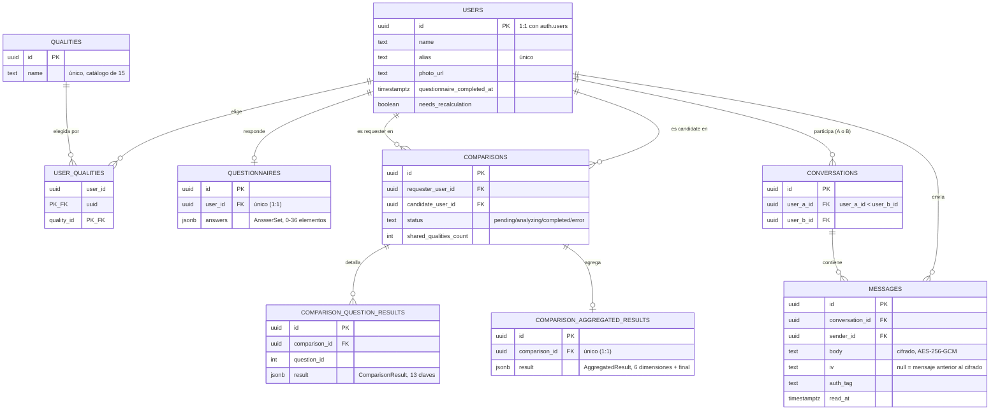

# AfinIA — Compatibility Check (TFM)

App web que mide la compatibilidad entre dos personas mediante un cuestionario de 36 preguntas
analizado por IA (Groq, con OpenRouter como alternativa), comparando a cada usuario contra los 3
candidatos más afines de un pool preseleccionado por cualidades personales compartidas. Proyecto de
Trabajo de Fin de Máster.

## Stack

- **Backend**: [NestJS](https://nestjs.com/) 11 + `@nestjs/cqrs` (Commands/Events selectivos) +
  `nestjs-pino` (logging estructurado a stdout; sin persistencia externa, ver `design.md` decisión 8b).
- **Frontend**: [Angular](https://angular.dev/) 22 + Bootstrap 5 / Bootstrap Icons / ng-bootstrap
  (recompilado desde Sass con la paleta de marca AfinIA) + `@supabase/supabase-js`.
- **Datos/Auth/Storage**: [Supabase](https://supabase.com/) (PostgreSQL + Auth + Storage).
- **Docker**: no se usa en producción — la CLI de Supabase (`npx supabase start`) lo usa para levantar
  una réplica local completa del stack (Postgres, Auth, Storage, Kong...), tanto para desarrollo local
  como para el job de tests de integración de la CI, contra una base de datos real en vez de mocks.
- **Tipos compartidos**: `packages/shared-types` (contrato único frontend/backend, validado con Zod).
- **CI**: GitHub Actions (lint + tests unitarios + tests e2e + build, y tests de integración contra
  el stack local de Supabase). Despliegue vía integración nativa de Vercel (frontend) y Render
  (backend) — sin Terraform ni workflow de deploy propio.

## Despliegue

La aplicación está desplegada y en funcionamiento (plan gratuito en ambos servicios):

- **Frontend**: <https://compatibility-check-app.vercel.app>
- **Backend (API)**: <https://compatibility-check-app.onrender.com>

Detalle completo de la configuración de cada servicio en [`docs/architecture.md`](docs/architecture.md).
El backend está en el plan gratuito de Render: la primera petición tras ~15 min de inactividad puede
tardar 30-60s en responder (cold-start) — ver "Limitaciones de las herramientas gratuitas" más abajo.

## Slides y vídeo (TFM)

- **Slides**: <https://compatibility-check-app.vercel.app/slides.html> — servidas como asset estático
  del propio frontend (`apps/frontend/public/slides.html`, copia de
  [`docs/slides.html`](docs/slides.html), que es la fuente) precisamente para que el enlace sea
  público sin depender de los permisos de un Artifact.
- **Vídeo**: pendiente de grabar y enlazar.

## Funcionalidades principales

- **Registro y autenticación** por email/contraseña (Supabase Auth), con recuperación de contraseña.
- **Completar perfil**: nombre, alias único, foto y selección de exactamente 5 cualidades personales.
- **Cuestionario de compatibilidad** de 36 preguntas, en un wizard de 6 bloques ponderados
  (5/5/15/20/25/30%), editable después de completado.
- **Selección automática de candidatos**: hasta 3 personas más afines por cualidades compartidas,
  calculada una única vez al completar el cuestionario.
- **Análisis de compatibilidad por IA** (Groq, con OpenRouter como alternativa): puntuación por 6
  dimensiones y explicación por pregunta, sin exponer nunca el texto de ninguna respuesta.
- **Dashboard de resultados**: tarjeta por candidato con score final, gráfico radar por dimensión y
  detalle expandible por pregunta; se actualiza solo mientras el análisis está en curso.
- **Recalcular compatibilidad** bajo demanda tras editar las propias respuestas o cualidades.
- **Chat interno** entre usuarios ya comparados entre sí.
- **Configuración**: edición de perfil, cuestionario y contraseña desde una única pantalla.
- **Diseño responsive** en las 12 pantallas de la aplicación.

## Usuario y contraseña de prueba

La aplicación tiene login (Supabase Auth). Tres cuentas de prueba, todas con la misma contraseña,
ninguna con datos personales reales — son usuarios sintéticos de `supabase/seed/`:

- **Con resultados ya calculados** (dashboard, radar y chat visibles sin rellenar nada):
  - Email: `elena.luna@seed.compatibility-check.local`
  - Contraseña: `Afinia-TFM-2026!`
- **Para probar el chat de verdad, en las dos direcciones**: esta cuenta y `elena.luna` ya tienen
  compatibilidad calculada entre sí — inicia sesión con las dos a la vez (dos navegadores distintos,
  o uno normal y otro en incógnito) para escribir y responder mensajes desde ambos lados:
  - Email: `marta.creativa@seed.compatibility-check.local`
  - Contraseña: `Afinia-TFM-2026!`
- **Cuenta nueva, sin perfil** (para probar el alta completa: perfil, cuestionario, matching) — no
  sirve para probar el chat con `elena.luna`: sus candidatos dependerán de qué cualidades elijas al
  completar el perfil, sin garantía de que coincidan con las suyas:
  - Email: `demo@seed.compatibility-check.local`
  - Contraseña: `Afinia-TFM-2026!`
  - Para rellenar el cuestionario de 36 preguntas sin pensar cada respuesta:
    [`docs/respuestas-ejemplo-cuestionario.md`](docs/respuestas-ejemplo-cuestionario.md) — cópialas y
    pégalas tal cual, bloque a bloque.

## Estructura del monorepo

```
apps/
  backend/    # NestJS — API, orquestación de IA, acceso a datos
  frontend/   # Angular — toda la interfaz de usuario
packages/
  shared-types/  # Interfaces + esquemas Zod compartidos entre backend y frontend
supabase/
  migrations/    # Esquema SQL + políticas RLS
  templates/     # Plantillas de email de Supabase Auth con marca AfinIA
  seed/          # Datos sintéticos de prueba
openspec/
  specs/           # Fuente de verdad vigente: un spec.md por capability (10, ver más abajo)
  changes/archive/2026-08-18-build-compatibility-mvp/  # Cambio original ya archivado (166/166
                   # tareas) — proposal.md/design.md/tasks.md como registro histórico de decisiones
docs/
  plan.md          # Narrativa completa de contexto y decisiones (complementa design.md)
  architecture.md  # Configuración resultante de infraestructura (Auth, Storage, CI/CD)
  brand/           # Assets de marca (logo, favicons)
```

## Modelo de datos



`comparisons` y sus dos tablas de detalle no tienen `GRANT` a `authenticated` — solo el backend con
`service_role` accede a ellas (ver "Seguridad"). Esquema completo, con comentarios de cada decisión,
en [`supabase/migrations/`](supabase/migrations/).

## Integración con la IA: ejemplo real

Petición real a Groq (`apps/backend/src/ai/groq.provider.ts`) — un lote de 6 preguntas por llamada,
recortado aquí a 1 para que se lea cómodo:

```json
{
  "model": "openai/gpt-oss-120b",
  "reasoning_effort": "low",
  "messages": [
    {
      "role": "system",
      "content": "Eres un psicólogo especializado en relaciones de pareja y compatibilidad interpersonal... Debes responder ÚNICAMENTE con un array JSON válido... con exactamente un objeto por cada pregunta recibida... (prompt completo en apps/backend/src/ai/prompts/compatibility-prompt.ts)"
    },
    {
      "role": "user",
      "content": "Compara las siguientes 6 preguntas y respuestas entre los usuarios \"a1b2c3d4-...\" y \"e5f6a7b8-...\":\n\n1. Pregunta: \"¿Qué significa para ti tener una 'vida perfecta'?\"\n   Respuesta de \"a1b2c3d4-...\": \"No tener una lista de tareas pendientes resonando en la cabeza todo el tiempo.\"\n   Respuesta de \"e5f6a7b8-...\": \"Tener tiempo de sobra para mis proyectos y la gente que quiero.\"\n\n[... 5 preguntas más del mismo bloque ...]\n\nDevuelve el array JSON con 6 objetos, en el mismo orden que las preguntas anteriores."
    }
  ]
}
```

Respuesta cruda de la API (formato estándar de chat completion; `content` es un string, no JSON
anidado de verdad):

```json
{
  "choices": [
    {
      "message": {
        "content": "[{\"pregunta\":\"¿Qué significa para ti tener una 'vida perfecta'?\",\"id_usuario_1\":\"a1b2c3d4-...\",\"respuesta_usuario_1\":\"No tener una lista de tareas pendientes...\",\"id_usuario_2\":\"e5f6a7b8-...\",\"respuesta_usuario_2\":\"Tener tiempo de sobra...\",\"compatibilidad\":7.80,\"emocional\":7.50,\"valores\":8.20,\"estilo\":6.90,\"intereses\":7.00,\"madurez\":8.00,\"apertura\":7.60,\"explicación\":\"Ambos priorizan el tiempo personal sobre la productividad, aunque lo enmarcan de forma algo distinta.\"}, ...]"
      }
    }
  ]
}
```

Ese `content`, ya descodificado y validado contra el esquema esperado
(`comparisonResultSchema` de `shared-types`) antes de persistirse — el primero de los 6 objetos:

```json
{
  "pregunta": "¿Qué significa para ti tener una 'vida perfecta'?",
  "id_usuario_1": "a1b2c3d4-...",
  "respuesta_usuario_1": "No tener una lista de tareas pendientes resonando en la cabeza todo el tiempo.",
  "id_usuario_2": "e5f6a7b8-...",
  "respuesta_usuario_2": "Tener tiempo de sobra para mis proyectos y la gente que quiero.",
  "compatibilidad": 7.80,
  "emocional": 7.50,
  "valores": 8.20,
  "estilo": 6.90,
  "intereses": 7.00,
  "madurez": 8.00,
  "apertura": 7.60,
  "explicación": "Ambos priorizan el tiempo personal sobre la productividad, aunque lo enmarcan de forma algo distinta."
}
```

Este detalle por pregunta (con `respuesta_usuario_1/2` incluidas) se guarda tal cual en
`comparison_question_results` — pero nunca se expone por API (ver "Seguridad"): el endpoint de
detalle filtra esas dos claves antes de responder.

## Arquitectura

Más allá de qué tecnologías se usan (arriba) y dónde vive cada cosa (arriba), estas son las
decisiones de diseño detrás del código:

- **CQRS selectivo**: `@nestjs/cqrs` con Commands solo donde hay un evento de dominio real que
  publicar (completar el cuestionario), no en cada operación de escritura — el resto (`PATCH` de
  perfil, envío de un mensaje de chat...) son servicios normales, sin la sobrecarga de un Command
  para algo que no lo necesita.
- **Módulos desacoplados por eventos, al estilo mediator**: `QuestionnaireCompletedEvent` dispara la
  selección de candidatos (`matching`), que a su vez publica `ComparisonsCreatedEvent` y desencadena
  el análisis por IA (`ai`). Ninguno de los tres módulos importa a los otros dos — solo conocen el
  tipo del evento al que reaccionan, nunca la clase concreta que lo publicó.
- **Puertos y adaptadores para el proveedor de IA** (mismo espíritu que Clean Architecture, sin
  llevarlo a los cuatro anillos completos): `ai-provider.interface.ts` aísla al orquestador de si el
  proveedor activo es Groq u OpenRouter — añadir un proveedor nuevo, o cambiar el activo, es una
  clase nueva implementando la misma interfaz, sin tocar el resto del sistema.
- **El backend como único gatekeeper para los datos sensibles**: `comparisons` y los mensajes de
  chat nunca son accesibles directamente por el cliente, ni siquiera con RLS de por medio — todo
  pasa por el backend. Para el resto (`users`, `questionnaires`) sí hay acceso directo por
  PostgREST, protegido en una segunda capa por RLS — dos estrategias de seguridad distintas, elegida
  cada una según qué tan sensible es el dato.
- **Frontend zoneless**: sin `zone.js`, la reactividad depende solo de *signals* — guards
  funcionales que devuelven un `UrlTree` en vez de una ruta a pelo, e intervalos de sondeo
  inyectables (`InjectionToken`) para poder sobreescribirlos en los tests.

## Seguridad

- **Contraseñas nunca en texto plano**: Supabase Auth (GoTrue) las hashea con `bcrypt` antes de
  persistirlas — este código no las ve, no las loguea, no las guarda él mismo. Toda contraseña nueva
  exige además mayúscula, minúscula y carácter especial, informado *antes* de fallar, no solo después
  (ver "Usuario y contraseña de prueba").
- **JWT delegado, no reinventado**: el backend nunca implementa su propia verificación de firma ni
  gestiona un secreto de JWT propio — valida cada token llamando a la propia API de Supabase Auth
  (`getUser`), la misma fuente de verdad que lo emitió.
- **El backend como único gatekeeper para lo más sensible**: `comparisons` y los mensajes de chat
  (ver "Arquitectura") nunca son accesibles directamente por el cliente, ni con RLS de por medio.
- **Minimización de información**: pedir el detalle de una comparación o un mensaje que no es tuyo,
  o que directamente no existe, responde exactamente lo mismo en los dos casos (un 404 idéntico) —
  nunca revela si algo existe pero no es tuyo frente a si no existe en absoluto.
- **Cifrado en reposo del chat**: el cuerpo de cada mensaje se cifra con AES-256-GCM antes de
  guardarse en Postgres, con una clave propia de la aplicación (`CHAT_ENCRYPTION_KEY`) que solo tiene
  el backend, nunca en el repositorio — cifrado en reposo, no de extremo a extremo (ver "Próximas
  mejoras" para el motivo).
- **CORS restringido**: el backend solo acepta peticiones de los orígenes configurados
  explícitamente en `CORS_ORIGIN`, nunca abierto a cualquier origen.

## Empezar a desarrollar

Requiere Node.js 24+ y npm. Los tests de integración además requieren
[Docker Desktop](https://www.docker.com/products/docker-desktop/) (usan el stack local de Supabase).

```bash
npm install                          # instala todos los workspaces y compila packages/shared-types
                                      # automáticamente (postinstall), para que backend/frontend
                                      # puedan importarlo ya compilado
npm run lint                         # ESLint (backend + frontend)
npm test                             # tests unitarios (Jest + Karma/Jasmine), sin Docker
npm run test:e2e                     # tests e2e del backend (AppModule en memoria, sin Docker)
npm run build                        # build de producción de ambas apps
```

```bash
npm run start:dev --workspace=apps/backend    # backend en watch mode (http://localhost:3000)
npm run start --workspace=apps/frontend       # frontend en dev server (http://localhost:4200)
```

Desde la sección 11 (`core/shell`, guards de ruta), el frontend ya llama de verdad a Supabase Auth y
al backend (antes era un scaffold vacío que no necesitaba ninguno de los dos arrancado). Para
recorrer la app más allá de la landing pública hace falta, además, `npx supabase start` (mismo stack
local que usan los tests de integración) y el backend en marcha — `apps/frontend/src/environments/
environment.ts` ya apunta a sus URLs por defecto (`http://127.0.0.1:54321` / `http://localhost:3000`),
sin configuración adicional.

### Tests de integración

Ejercitan RLS y el esquema real de Postgres contra el stack local de Supabase (nunca el proyecto
real) — ver `design.md`, decisión 11.

```bash
npx supabase start
set -a
eval "$(npx supabase status -o env \
  --override-name api.url=SUPABASE_URL \
  --override-name auth.anon_key=SUPABASE_ANON_KEY \
  --override-name auth.service_role_key=SUPABASE_SERVICE_ROLE_KEY \
  --override-name db.url=SUPABASE_DB_URL)"
set +a
npm run test:integration
npx supabase stop
```

### Semilla de datos sintéticos

`supabase/seed/seed.ts` puebla el catálogo de 15 cualidades, 10 usuarios sintéticos completos
(`supabase/seed/seed-users.json`, congelado — sin llamadas al proveedor de IA) y una cuenta de
demostración sin perfil (sección 18 de `tasks.md`). Idempotente: se puede ejecutar varias veces sin
duplicar ni recrear nada.

```bash
npx supabase start
set -a
eval "$(npx supabase status -o env \
  --override-name api.url=SUPABASE_URL \
  --override-name auth.anon_key=SUPABASE_ANON_KEY \
  --override-name auth.service_role_key=SUPABASE_SERVICE_ROLE_KEY \
  --override-name db.url=SUPABASE_DB_URL)"
set +a
npm run seed
```

Contra el proyecto real (tras la tarea 19.1), exporta en su lugar `SUPABASE_URL` y
`SUPABASE_SERVICE_ROLE_KEY` de ese proyecto antes de `npm run seed`. El seed nunca fija ni resetea la
contraseña de una cuenta que ya existe (crea cada cuenta nueva con una al azar, y no la toca en
re-seeds posteriores) — las dos cuentas de prueba documentadas más abajo tienen su contraseña fijada
a mano desde el Dashboard de Supabase, fuera de este script, precisamente para poder documentarla.

## Limitaciones de las herramientas gratuitas (importante antes de una demo en vivo)

Todo el stack corre en planes gratuitos (design.md, decisión 10) — esto es lo que hay que tener en
cuenta de cara a una presentación en vivo, con lo ya confirmado real durante la tarea 20.2 (verificación
end-to-end) marcado explícitamente:

- **Groq — límite de tokens/minuto (confirmado real, mitigado)**: el free tier de Groq limita
  `openai/gpt-oss-120b` a 8.000 tokens/minuto. Analizar las 36 preguntas de una comparación (6 lotes)
  agotaba ese presupuesto con una sola comparación —el modelo gasta de media ~1.000-1.300 tokens
  ocultos de "razonamiento" por lote, además del propio contenido—, así que las 3 comparaciones
  creadas de golpe al completar el cuestionario dejaban 2 de cada 3 en `error` incluso con
  reintentos (reproducido de verdad contra la API real de Groq, no solo sospechado). **Mitigado en
  tres frentes** (`apps/backend/src/ai/`, ver `openspec/changes/archive/` para el detalle de cada
  decisión):
  1. `reasoning_effort: 'low'` en cada petición — ~38% menos tokens por lote, misma calidad de
     puntuación/explicación comprobada con los mismos datos reales.
  2. Backoff entre reintentos realista (10s/25s, no los 50/150ms iniciales — Groq pide esperar ese
     margen tras un `429`, y 50/150ms nunca alcanzaba a recuperarse).
  3. **Analizar solo 6 preguntas muestreadas (1 al azar de cada uno de los 6 bloques del
     cuestionario) en vez de las 36 completas** — medido contra la API real
     (`tokens ≈ 600 + 292 × preguntas`): las 3 comparaciones de una tacada caben con margen dentro
     del presupuesto del minuto, cosa que 36 preguntas no permitían ni con `reasoning_effort: 'low'`.
     El muestreo es estratificado por bloque (nunca aleatorio puro sobre las 36) para no arriesgarse
     a dejar sin representar el bloque de mayor peso (30%). Efecto colateral positivo: ahora se
     envían menos respuestas del usuario al proveedor externo de IA por comparación (6 de 36, no
     todas).

  Si una comparación aun así quedara en `error`, el botón de reintentar
  (`POST /comparisons/:id/reanalyze`) vuelve a muestrear 6 preguntas nuevas al azar.
- **Groq — catálogo de modelos (confirmado real)**: Groq retira modelos con cierta frecuencia — el
  modelo original de este proyecto (`llama-3.3-70b-versatile`) dejó de existir y todas las llamadas
  devolvían `404` hasta sustituirlo por `openai/gpt-oss-120b`
  (`apps/backend/src/ai/groq.provider.ts`). Si el análisis empieza a fallar con `404` en vez de
  `429`, comprueba el catálogo vigente con `GET https://api.groq.com/openai/v1/models` (cabecera
  `Authorization: Bearer <GROQ_API_KEY>`) y actualiza `GROQ_MODEL` ahí.
- **Supabase Auth — límite de envío de emails (confirmado real, resuelto)**: el SMTP incluido en el
  free tier tiene un límite bajo de emails transaccionales (registro, recuperación de contraseña) —
  se agotó de verdad durante la tarea 20.2 tras varias altas/reintentos seguidos
  (`over_email_send_rate_limit`, `429`), bloqueando tanto nuevos registros como el reset de
  contraseña por email. Ese mismo SMTP por defecto además solo entrega a direcciones del equipo del
  proyecto en Supabase — bloqueaba el registro a cualquier usuario real, no solo cuando se agotaba
  el límite. **Resuelto configurando un SMTP propio de Gmail** en el Dashboard (Authentication →
  Emails → SMTP Settings; cuenta ad hoc dedicada a esto, no una personal), con plantillas propias con
  marca AfinIA (ver `supabase/templates/`): sube el límite a 30/hora y quita la restricción de
  destinatario. Sigue habiendo un respaldo si hiciera falta operar sin esperar a que se libere ese
  límite: fijar una contraseña directamente por la Admin API sin pasar por email
  (`PUT /auth/v1/admin/users/:id`, con `curl.exe` — no `Invoke-RestMethod` de PowerShell, que
  Supabase bloquea como "uso de la Secret key desde un navegador" por su `User-Agent` por defecto).
  Antes de la demo, evita registrar cuentas de prueba de más en el proyecto real.
- **Render — cold-start (documentado, no forzado a propósito durante la verificación)**: la primera
  petición tras ~15 min de inactividad tarda 30-60s en responder (free tier) — la pantalla de
  "procesando" ya lo tiene en cuenta, pero conviene "despertar" el backend con una petición de
  prueba unos minutos antes de empezar la presentación.
- **Vercel (sin incidencias, límites estándar del plan Hobby)**: ancho de banda y minutos de build
  mensuales limitados — sin problema para el volumen de una demo de TFM, no se ha necesitado ajustar
  nada.

## Próximas mejoras

- **Cifrado de extremo a extremo (E2EE) del chat interno**: hoy el cuerpo de cada mensaje se cifra en
  reposo antes de guardarse en Postgres (AES-256-GCM, ver `apps/backend/src/chat/message-encryption.ts`),
  pero con una clave que gestiona el propio backend, que sigue pudiendo descifrar para poder devolver
  los mensajes por el sondeo HTTP existente. E2EE de
  verdad — que ni siquiera el backend pudiera leer el contenido — no se ha aplicado en esta primera
  fase por varias razones concretas, no por descuido:
  - **Gestión de claves multidispositivo**: si la clave de descifrado vive solo en el navegador del
    usuario, cambiar de dispositivo o simplemente borrar datos del navegador dejaría sin acceso al
    historial de conversaciones, salvo que se construya además un sistema de backup/recuperación de
    claves — no trivial, y con sus propios riesgos si se implementa mal.
  - **Verificación de identidad**: cifrar de extremo a extremo sin verificar que la clave pública que
    recibes es de verdad la de tu interlocutor (y no la de un atacante interpuesto) da una falsa
    sensación de seguridad. Hacerlo bien exige una UX de verificación (los "números de seguridad" de
    apps como Signal) que no es trivial de diseñar bien en el alcance de un TFM.
  - **Coste/beneficio de esta fase**: el cifrado en reposo con clave de servidor ya sube de forma
    real el nivel de protección — contra una fuga de la base de datos, una `service_role key`
    filtrada, o alguien mirando el dashboard de Supabase directamente — con una fracción de la
    complejidad operativa de E2EE de verdad.

## Metodología

- **TDD real, no solo "hay tests"**: ciclo rojo-verde-refactor en las 4 capas del proyecto —
  funciones puras de dominio (sin mocks), servicios con dependencias externas (contra una
  interfaz/mock, nunca la red real), tests de integración contra un Supabase real (nunca el proyecto
  real — `test/factories/` + un pool fijo de cuentas), y e2e de cada endpoint. Ninguna tarea se da
  por completada sin su test correspondiente en verde.
- **Demostrado, no solo prometido**: el caso más claro es la política RLS de `users` — sin ella, 7 de
  los 10 casos de test fallan de verdad (confirmando el hueco real); con ella aplicada, 10 de 10 en
  verde. Rojo antes de arreglar, verde después — nunca al revés.
- **Logging estructurado** (`nestjs-pino`, JSON de fábrica, no un wrapper a mano) para no depurar a
  ciegas, sobre todo en la orquestación de llamadas a IA — la parte con más superficie de fallo real
  (red, límites de tasa del proveedor, JSON mal formado del LLM).
- **Desarrollo guiado por especificación**: ver la siguiente sección.

## Documentación y flujo de trabajo

Este proyecto sigue [OpenSpec](https://github.com/Fission-AI/OpenSpec). El cambio original
(`build-compatibility-mvp`) llegó a 166/166 tareas y ya está archivado en
`openspec/changes/archive/2026-08-18-build-compatibility-mvp/` — sus `proposal.md`/`design.md`/
`tasks.md` quedan ahí como registro histórico de decisiones (útil para la memoria del TFM), pero ya
no son la fuente de requisitos vigente. Esa fuente de verdad ahora es `openspec/specs/` (un
`spec.md` por capability — `authentication`, `candidate-matching`, `internal-chat`,
`personal-questionnaire`, `responsive-ui`, `results-dashboard`, `seed-data`, `user-registration`,
`user-settings`, `ai-compatibility-analysis`), sincronizada desde las delta specs del cambio al
archivarlo; consultar ahí si algo difiere de `docs/plan.md`.

Antes de tocar cualquier pantalla de `apps/frontend`, consultar
`.claude/skills/ui-design-consistency/` (estructura de página, sistema de botones/formularios,
tokens de color/tipografía exactos).
